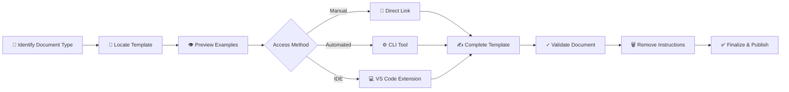

# 📚 Templates Index

> **Central registry for standardized documentation templates across Political Sphere**

<div align="center">

| Classification | Version | Last Updated |       Owner        | Review Cycle |
| :------------: | :-----: | :----------: | :----------------: | :----------: |
|  🔒 Internal   | `1.0.0` |  2025-10-29  | Documentation Team |  Quarterly   |

</div>

---

## 🎯 Purpose

This Templates Index serves as the central registry for all standardized document templates used across the Political Sphere project. Templates ensure consistency, completeness, and compliance across documentation while reducing cognitive load and accelerating document creation.

### 💡 Business Value

<table>
<tr>
<td width="20%"><b>🎨 Consistency</b></td>
<td>90% reduction in document variation across teams</td>
</tr>
<tr>
<td><b>⚡ Velocity</b></td>
<td>40-60% faster document creation vs. starting from scratch</td>
</tr>
<tr>
<td><b>✅ Compliance</b></td>
<td>Automated inclusion of mandatory fields reduces audit findings</td>
</tr>
<tr>
<td><b>🏆 Quality</b></td>
<td>Peer-reviewed structures ensure best practices are embedded</td>
</tr>
<tr>
<td><b>🚀 Onboarding</b></td>
<td>New team members productive in documentation from day one</td>
</tr>
</table>

---

## 📖 Using This Index

### 🔍 Template Selection



**Step-by-Step Process:**

| Step | Action                              | Tool/Method                                   |
| :--: | ----------------------------------- | --------------------------------------------- |
|  1️⃣  | **Identify** document type          | Use category navigator below                  |
|  2️⃣  | **Locate** appropriate template     | Click template link in index                  |
|  3️⃣  | **Preview** example documents       | See [Examples Gallery](#-training--resources) |
|  4️⃣  | **Access** template                 | Choose: Direct link • CLI • VS Code extension |
|  5️⃣  | **Complete** following instructions | Look for `<!-- comments -->` or `_italics_`   |
|  6️⃣  | **Validate** with checker           | `npm run validate:doc <file-path>`            |
|  7️⃣  | **Remove** template markup          | `npm run strip-instructions`                  |

### 📋 Template Request Process

<details>
<summary><b>🚀 Fast Track (Urgent)</b> - Response within 4 hours</summary>

<br>

**When to use:** Time-sensitive needs, blocking critical work

**Process:**

1. Contact Documentation Team in `#docs-urgent` Slack channel
2. Temporary exemption granted within **4 hours**
3. Follow-up template creation scheduled automatically

**Requirements:** Brief justification of urgency

</details>

<details>
<summary><b>📝 Standard Process</b> - Development within 2 weeks</summary>

<br>

**Timeline:** 5 business days review + 10 days development

**Steps:**

1. 🔍 Search existing templates and examples
2. 📊 Check [Template Backlog](https://github.com/PoliticalSphere/political-sphere/projects/templates) for planned templates
3. 📤 Submit request via [RFC process](../02-governance/rfcs/README.md) including:
   - 🎯 Use case and frequency of need
   - 🔄 Attempted alternatives
   - 📐 Proposed structure (draft)
   - ⚖️ Compliance/regulatory drivers (if applicable)
4. ⏰ Documentation Team reviews within **5 business days**
5. ✅ Approved templates developed within **sprint (2 weeks)**

</details>

<details>
<summary><b>🚨 Emergency Override</b> - Critical situations only</summary>

<br>

**⚠️ Use sparingly:** Incident response, regulatory deadline, executive directive

**Requirements:**

- 📝 Document **why** template cannot be used
- ✍️ Get approval from **Director-level or above**
- 🏷️ Create issue with `template-emergency-override` label
- 🔄 Retrospective review within **48 hours** post-incident

**Consequences:** Tracked metric, requires follow-up action

</details>

---

## 📑 Template Categories

<div align="center">

**Quick Navigation:** [Governance](#1-governance--decision-making) • [Security](#2-security--risk-management) • [AI/ML](#3-ai--machine-learning) • [Operations](#4-operational-documentation) • [Product](#5-product--design) • [Legal](#6-legal--compliance) • [Change](#7-change-management)

</div>

---

### 1️⃣ Governance & Decision-Making

#### 📐 1.1 Architectural Decision Records (ADR)

<table>
<tr><td><b>📍 Location</b></td><td><a href="../02-governance/architectural-decision-records/adr-template.md">adr-template.md</a></td></tr>
<tr><td><b>🎯 Purpose</b></td><td>Document significant architectural decisions and their rationale</td></tr>
<tr><td><b>⏱️ When to Use</b></td><td>Any decision affecting system structure, technology choices, or architectural patterns</td></tr>
<tr><td><b>✅ Mandatory Fields</b></td><td><code>Context</code> • <code>Decision</code> • <code>Consequences</code> • <code>Status</code></td></tr>
<tr><td><b>👥 Review Required</b></td><td>Architecture Review Board</td></tr>
<tr><td><b>⏰ Est. Time</b></td><td>2-4 hours</td></tr>
</table>

#### 💬 1.2 Request for Comments (RFC)

<table>
<tr><td><b>📍 Location</b></td><td><a href="../02-governance/rfcs/rfc-template.md">rfc-template.md</a></td></tr>
<tr><td><b>🎯 Purpose</b></td><td>Propose and discuss significant changes requiring stakeholder input</td></tr>
<tr><td><b>⏱️ When to Use</b></td><td>Major feature proposals, process changes, cross-team initiatives</td></tr>
<tr><td><b>✅ Mandatory Fields</b></td><td><code>Summary</code> • <code>Motivation</code> • <code>Design</code> • <code>Drawbacks</code> • <code>Alternatives</code></td></tr>
<tr><td><b>👥 Review Required</b></td><td>Minimum 3 reviewers from affected teams</td></tr>
<tr><td><b>⏰ Est. Time</b></td><td>1-2 days</td></tr>
</table>

---

### 2️⃣ Security & Risk Management

#### 🛡️ 2.1 Threat Model (STRIDE)

<table>
<tr><td><b>📍 Location</b></td><td><code>threat-modeling-stride.md</code> (Template section)</td></tr>
<tr><td><b>🎯 Purpose</b></td><td>Systematically identify and assess security threats</td></tr>
<tr><td><b>⏱️ When to Use</b></td><td>New features • Architecture changes • Third-party integrations</td></tr>
<tr><td><b>✅ Mandatory Fields</b></td><td><code>System boundary</code> • <code>Threat enumeration</code> • <code>Risk ratings</code> • <code>Mitigations</code></td></tr>
<tr><td><b>👥 Review Required</b></td><td>Security Team + Feature Owner</td></tr>
<tr><td><b>⏰ Est. Time</b></td><td>4-6 hours</td></tr>
</table>

#### 📋 2.2 Incident Postmortem

<table>
<tr><td><b>📍 Location</b></td><td><a href="../06-security-and-risk/incident-response/postmortem-template.md">postmortem-template.md</a></td></tr>
<tr><td><b>🎯 Purpose</b></td><td>Document incidents and extract learnings to prevent recurrence</td></tr>
<tr><td><b>⏱️ When to Use</b></td><td>All Severity 1-3 incidents • Near-misses (discretion)</td></tr>
<tr><td><b>✅ Mandatory Fields</b></td><td><code>Timeline</code> • <code>Impact</code> • <code>Root Cause</code> • <code>Action Items</code></td></tr>
<tr><td><b>👥 Review Required</b></td><td>Incident Commander + Engineering Manager</td></tr>
<tr><td><b>⏰ Est. Time</b></td><td>4-6 hours</td></tr>
</table>

#### 🔐 2.3 Data Protection Impact Assessment (DPIA)

<table>
<tr><td><b>📍 Location</b></td><td><code>data-protection-impact-assessment-dpia.md</code> (Template section)</td></tr>
<tr><td><b>🎯 Purpose</b></td><td>Assess privacy risks for data processing activities</td></tr>
<tr><td><b>⏱️ When to Use</b></td><td>New data processing • Significant changes • High-risk processing</td></tr>
<tr><td><b>✅ Mandatory Fields</b></td><td><code>Processing description</code> • <code>Necessity</code> • <code>Risks</code> • <code>Safeguards</code></td></tr>
<tr><td><b>👥 Review Required</b></td><td>Data Protection Officer (DPO) + Legal</td></tr>
<tr><td><b>⏰ Est. Time</b></td><td>2-4 days</td></tr>
</table>

---

### 3️⃣ AI & Machine Learning

#### 🤖 3.1 Model Card

<table>
<tr><td><b>📍 Location</b></td><td><a href="../07-ai-and-simulation/model-inventory-and-system-cards/model-card-template.md">model-card-template.md</a></td></tr>
<tr><td><b>🎯 Purpose</b></td><td>Document model details, performance, limitations, and ethical considerations</td></tr>
<tr><td><b>⏱️ When to Use</b></td><td>Every ML model deployed to production or used in decision-making</td></tr>
<tr><td><b>✅ Mandatory Fields</b></td><td><code>Model details</code> • <code>Training data</code> • <code>Performance metrics</code> • <code>Limitations</code> • <code>Ethical considerations</code></td></tr>
<tr><td><b>👥 Review Required</b></td><td>AI Ethics Board + ML Engineering Lead</td></tr>
<tr><td><b>⏰ Est. Time</b></td><td>4-8 hours</td></tr>
</table>

#### 🧠 3.2 System Card

<table>
<tr><td><b>📍 Location</b></td><td><a href="../07-ai-and-simulation/model-inventory-and-system-cards/system-card-template.md">system-card-template.md</a></td></tr>
<tr><td><b>🎯 Purpose</b></td><td>Document AI systems comprising multiple models and components</td></tr>
<tr><td><b>⏱️ When to Use</b></td><td>Multi-model systems • Agent orchestration • Production AI workflows</td></tr>
<tr><td><b>✅ Mandatory Fields</b></td><td><code>System architecture</code> • <code>Component inventory</code> • <code>Data flows</code> • <code>Safety mechanisms</code></td></tr>
#### 📘 4.1 Runbook

<table>
<tr><td><b>📍 Location</b></td><td><code>runbooks-index.md</code> (Runbook Template section)</td></tr>
<tr><td><b>🎯 Purpose</b></td><td>Step-by-step operational procedures for common tasks and incidents</td></tr>
<tr><td><b>⏱️ When to Use</b></td><td>Repetitive operational tasks • Incident response procedures</td></tr>
<tr><td><b>✅ Mandatory Fields</b></td><td><code>Prerequisites</code> • <code>Steps</code> • <code>Verification</code> • <code>Rollback procedure</code></td></tr>
<tr><td><b>👥 Review Required</b></td><td>On-call Engineer + SRE Lead</td></tr>
<tr><td><b>⏰ Est. Time</b></td><td>3-5 hours</td></tr>
</table>

#### 📊 4.2 Service Level Objective (SLO)

<table>
<tr><td><b>📍 Location</b></td><td><code>slos-slas-and-sli-catalog.md</code> (SLO Template section)</td></tr>
<tr><td><b>🎯 Purpose</b></td><td>Define and track reliability targets</td></tr>
<tr><td><b>⏱️ When to Use</b></td><td>All production services</td></tr>
<tr><td><b>✅ Mandatory Fields</b></td><td><code>SLI definition</code> • <code>Target</code> • <code>Measurement window</code> • <code>Error budget policy</code></td></tr>
<tr><td><b>👥 Review Required</b></td><td>Product Manager + SRE + Engineering Lead</td></tr>
<tr><td><b>⏰ Est. Time</b></td><td>4-6 hours</td></tr>
</table>

---

### 5️⃣ Product & Design`../09-observability-and-ops/slos-slas-and-sli-catalog.md` (section: SLO Template)

**Purpose:** Define and track reliability targets

#### 🎮 5.1 Game Design Document (GDD)

<table>
<tr><td><b>📍 Location</b></td><td><a href="../08-game-design-and-mechanics/game-design-document-gdd.md">game-design-document-gdd.md</a></td></tr>
<tr><td><b>🎯 Purpose</b></td><td>Comprehensive specification for game features and mechanics</td></tr>
<tr><td><b>⏱️ When to Use</b></td><td>New game features • Major mechanic changes</td></tr>
<tr><td><b>✅ Mandatory Fields</b></td><td><code>Feature overview</code> • <code>Mechanics</code> • <code>User experience</code> • <code>Balance considerations</code></td></tr>
<tr><td><b>👥 Review Required</b></td><td>Game Design Lead + Product Manager</td></tr>
<tr><td><b>⏰ Est. Time</b></td><td>1-3 days</td></tr>
</table>

#### 📝 5.2 User Story / Feature Specification

<table>
<tr><td><b>📍 Location</b></td><td><code>user-story-template.md</code> 🚧 <i>(Planned)</i></td></tr>
<tr><td><b>🎯 Purpose</b></td><td>Define user-facing features with acceptance criteria</td></tr>
<tr><td><b>⏱️ When to Use</b></td><td>All feature development</td></tr>
<tr><td><b>✅ Mandatory Fields</b></td><td><code>User story</code> • <code>Acceptance criteria</code> • <code>Dependencies</code> • <code>Edge cases</code></td></tr>
<tr><td><b>👥 Review Required</b></td><td>Product Manager + Tech Lead</td></tr>
<tr><td><b>⏰ Est. Time</b></td><td>2-4 hours</td></tr>
</table>

---

### 6️⃣ Legal & ComplianceD - `templates/user-story-template.md` (planned)

**Purpose:** Define user-facing features with acceptance criteria

#### 🔒 6.1 Privacy Policy

<table>
<tr><td><b>📍 Location</b></td><td><a href="../03-legal-and-compliance/privacy-policy.md">privacy-policy.md</a></td></tr>
<tr><td><b>🎯 Purpose</b></td><td>Publicly disclose data processing practices</td></tr>
<tr><td><b>⏱️ When to Use</b></td><td>Initial launch • Material changes to data processing</td></tr>
<tr><td><b>✅ Mandatory Fields</b></td><td><code>Data collected</code> • <code>Purposes</code> • <code>Legal basis</code> • <code>Rights</code> • <code>Retention</code></td></tr>
<tr><td><b>👥 Review Required</b></td><td>⚠️ Legal + DPO + <b>Executive approval required</b></td></tr>
<tr><td><b>⏰ Est. Time</b></td><td>3-5 days</td></tr>
</table>

#### 📜 6.2 Terms of Service

<table>
<tr><td><b>📍 Location</b></td><td><a href="../03-legal-and-compliance/terms-of-service.md">terms-of-service.md</a></td></tr>
<tr><td><b>🎯 Purpose</b></td><td>Define contractual relationship with users</td></tr>
<tr><td><b>⏱️ When to Use</b></td><td>Initial launch • Material changes to service or business model</td></tr>
<tr><td><b>✅ Mandatory Fields</b></td><td><code>Service description</code> • <code>User obligations</code> • <code>Liability</code> • <code>Dispute resolution</code></td></tr>
<tr><td><b>👥 Review Required</b></td><td>⚠️ Legal + <b>Executive approval required</b></td></tr>
<tr><td><b>⏰ Est. Time</b></td><td>3-5 days</td></tr>
</table>

---

### 7️⃣ Change Management`../03-legal-and-compliance/terms-of-service.md`](../03-legal-and-compliance/terms-of-service.md)

**Purpose:** Define contractual relationship with users

#### 🔄 7.1 Change Request

<table>
<tr><td><b>📍 Location</b></td><td><code>change-management-policy.md</code> (Change Request Template section)</td></tr>
<tr><td><b>🎯 Purpose</b></td><td>Formally request and track changes to production systems</td></tr>
<tr><td><b>⏱️ When to Use</b></td><td>Production deployments • Infrastructure changes • Configuration updates</td></tr>
<tr><td><b>✅ Mandatory Fields</b></td><td><code>Change description</code> • <code>Impact analysis</code> • <code>Rollback plan</code> • <code>Approvals</code></td></tr>
<tr><td><b>👥 Review Required</b></td><td>Change Advisory Board (for high-risk changes)</td></tr>
<tr><td><b>⏰ Est. Time</b></td><td>2-3 hours</td></tr>
</table>

#### 📢 7.2 Release Notes

<table>
<tr><td><b>📍 Location</b></td><td><code>artifact-management-and-release-notes.md</code> (Template section)</td></tr>
<tr><td><b>🎯 Purpose</b></td><td>Communicate changes to users and stakeholders</td></tr>
<tr><td><b>⏱️ When to Use</b></td><td>Every production release</td></tr>
<tr><td><b>✅ Mandatory Fields</b></td><td><code>Version</code> • <code>Date</code> • <code>Features</code> • <code>Improvements</code> • <code>Bug fixes</code> • <code>Breaking changes</code></td></tr>
<tr><td><b>👥 Review Required</b></td><td>Product Manager + Engineering Lead</td></tr>
<tr><td><b>⏰ Est. Time</b></td><td>1-2 hours</td></tr>
</table>

---

## ⚙️ Template Governance `../05-engineering-and-devops/ci-cd/artifact-management-and-release-notes.md` (section: Template)

**Purpose:** Communicate changes to users and stakeholders  
**When to Use:** Every production release  
**Mandatory Fields:** Version, date, new features, improvements, bug fixes, breaking changes  
**Review Required:** Product Manager + Engineering Lead

---

## Template Governance

### Version Control

- All templates are version-controlled in the repository at `docs/document-control/templates/`
- Template versions follow semantic versioning (MAJOR.MINOR.PATCH)
  - **MAJOR:** Breaking changes (structure changes requiring document migration)
  - **MINOR:** New optional sections, clarifications
  - **PATCH:** Typo fixes, formatting improvements
- Breaking changes to templates require RFC process
- Template change history is tracked in [change-log.md](./change-log.md)
- Each template includes YAML frontmatter with version metadata

### Template Quality Standards

All templates must include:

- ✅ Clear purpose statement and business justification
- ✅ When-to-use guidance with concrete examples
- ✅ When-NOT-to-use anti-patterns
- ✅ Mandatory vs. optional sections clearly marked with `[REQUIRED]` and `[OPTIONAL]` tags
- ✅ Embedded instructions (removable via `npm run strip-instructions`)
- ✅ At least one completed example in `docs/examples/`
- ✅ Review/approval requirements with named roles (not individuals)
- ✅ Related templates cross-referenced
- ✅ Estimated completion time
- ✅ Accessibility: Screen reader compatible, plain language
- ✅ Internationalization hooks (if applicable)
- ✅ Automated validation rules (JSON schema or lint rules)
- ✅ Compliance mapping (which regulations/standards this satisfies)

### Template Testing & Validation

Before approving new templates:

1. **Pilot Test:** Minimum 3 users create real documents
2. **Accessibility Check:** WCAG 2.1 AA compliance verified
3. **Automated Validation:** Linter rules created and tested
4. **Completeness Check:** All mandatory sections can be completed with available information
5. **Review Burden Analysis:** Review time ≤ 30 minutes for standard documents
6. **Compliance Mapping:** Legal/security review confirms regulatory coverage

### Template Maintenance

- **Review Frequency:** Quarterly (scheduled reviews) + triggered reviews
- **Triggered Review Conditions:**
  - > 10 deviation requests in 90 days
  - Regulatory change affecting template
  - <3.5/5.0 satisfaction rating
  - Security/privacy incident related to template
- **Owner:** Documentation Team (primary), Domain SMEs (co-owners)
- **Feedback Mechanism:**
  - GitHub issue with label `template-feedback`
  - Inline comments via PR
  - Quarterly survey
  - Post-document creation NPS survey (automated)
- **Deprecation Process:**
  - 90-day notice period (posted in #announcements + email)
  - Migration guide and automated migration script (where feasible)
  - Legacy template retained for 2 years for historical document context
  - Analytics tracking to ensure migration completion

---

## Template Metrics & Usage

### Adoption Tracking

We track the following metrics to ensure template effectiveness:

**Usage Metrics:**

- Template adoption rate (% of documents using approved templates)
- Template coverage (% of document types with approved templates)
- Template completion rate (started vs. published documents)
- Time-to-complete by template type (p50, p90, p99)
- Automation rate (% of documents created via CLI/tooling vs. manual)

**Quality Metrics:**

- Template satisfaction scores (post-creation NPS survey)
- Reviewer satisfaction (time spent reviewing, clarity of submissions)
- Template deviation requests (frequency and reasons)
- Document quality scores (from reviewers using rubric)
- First-time-right rate (documents requiring <2 revision cycles)

**Compliance Metrics:**

- Audit finding rate (findings attributable to template gaps)
- Mandatory field completion rate
- Compliance coverage map (which regulations each template addresses)
- Override usage (frequency of emergency overrides)

**Business Impact Metrics:**

- Document creation velocity (documents/week trend)
- Review cycle time (submission to approval)
- Onboarding impact (time-to-first-document for new hires)
- Template ROI (time saved × hourly rate × usage count)

### Success Criteria

**Tier 1 (Mandatory):**

- ≥95% of documents in scope use approved templates
- ≥4.2/5.0 average satisfaction rating
- <5% deviation requests requiring template updates
- 100% of critical compliance areas covered by templates
- ≥90% mandatory field completion rate

**Tier 2 (Target):**

- ≥60% automation rate for routine documents
- ≤2 revision cycles for 80% of documents
- ≤24h median time from template to published (simple templates)
- ≥4.5/5.0 reviewer satisfaction with submission quality

**Tier 3 (Aspirational):**

- AI-assisted template suggestions (coming Q2 2026)
- Real-time collaborative editing integrated
- Automated translation for 5+ languages
- Zero-touch approval for low-risk, validated documents

### Metrics Dashboard

Live metrics available at: `https://metrics.politicalsphere.com/templates`  
Updated: Hourly  
Access: All employees

---

## Template Development Pipeline

### Lifecycle Stages

```
Proposed → Draft → Review → Pilot → Approved → Active → Deprecated
```

#### 1. Proposed

- RFC submitted with template need justification
- Stakeholder feedback collected

#### 2. Draft

- Template created by Documentation Team
- Initial review by subject matter experts

#### 3. Review

- Open for community feedback (2-week period)
- Adjustments made based on feedback

#### 4. Pilot

- Trial period with 3-5 early adopters
- Feedback incorporated

#### 5. Approved

- Final approval from Documentation Team
- Added to this index

#### 6. Active

- Generally available
- Periodic reviews and updates

## 📊 Quick Reference Matrix

<table>
<thead>
<tr>
<th>📄 Document Type</th>
<th>📍 Template</th>
<th>👥 Review Tier</th>
<th>⏰ Completion Time</th>
<th>🔗 Link</th>
</tr>
</thead>
<tbody>
<tr>
<td>📐 ADR</td>
<td><code>adr-template.md</code></td>
<td>Architecture Review</td>
<td>2-4 hours</td>
<td><a href="../02-governance/architectural-decision-records/adr-template.md">📎</a></td>
</tr>
<tr>
<td>💬 RFC</td>
<td><code>rfc-template.md</code></td>
<td>Multi-stakeholder</td>
<td>1-2 days</td>
<td><a href="../02-governance/rfcs/rfc-template.md">📎</a></td>
</tr>
<tr>
<td>📋 Postmortem</td>
<td><code>postmortem-template.md</code></td>
<td>Incident Commander</td>
<td>4-6 hours</td>
<td><a href="../06-security-and-risk/incident-response/postmortem-template.md">📎</a></td>
</tr>
<tr>
<td>🤖 Model Card</td>
<td><code>model-card-template.md</code></td>
<td>AI Ethics Board</td>
<td>4-8 hours</td>
<td><a href="../07-ai-and-simulation/model-inventory-and-system-cards/model-card-template.md">📎</a></td>
</tr>
<tr>
<td>🧠 System Card</td>
<td><code>system-card-template.md</code></td>
<td>AI Governance</td>
<td>1-2 days</td>
<td><a href="../07-ai-and-simulation/model-inventory-and-system-cards/system-card-template.md">📎</a></td>
</tr>
<tr>
<td>📘 Runbook</td>
<td><code>runbooks-index.md</code></td>
<td>SRE Review</td>
<td>3-5 hours</td>
<td><a href="../09-observability-and-ops/runbooks-index.md">📎</a></td>
</tr>
<tr>
<td>🔐 DPIA</td>
<td><code>dpia.md</code></td>
<td>DPO + Legal</td>
<td>2-4 days</td>
<td><a href="../03-legal-and-compliance/data-protection/data-protection-impact-assessment-dpia.md">📎</a></td>
</tr>
<tr>
<td>🛡️ Threat Model</td>
<td><code>threat-modeling-stride.md</code></td>
<td>Security Team</td>
<td>4-6 hours</td>
<td><a href="../06-security-and-risk/threat-modeling-stride.md">📎</a></td>
</tr>
</tbody>
</table>

---

## ❓ Frequently Asked Questions

| ADR | [adr-template.md](../02-governance/architectural-decision-records/adr-template.md) | Architecture Review | 2-4 hours |
| RFC | [rfc-template.md](../02-governance/rfcs/rfc-template.md) | Multi-stakeholder | 1-2 days |
| Incident Postmortem | [postmortem-template.md](../06-security-and-risk/incident-response/postmortem-template.md) | Incident Commander | 4-6 hours |
| Model Card | [model-card-template.md](../07-ai-and-simulation/model-inventory-and-system-cards/model-card-template.md) | AI Ethics Board | 4-8 hours |
| System Card | [system-card-template.md](../07-ai-and-simulation/model-inventory-and-system-cards/system-card-template.md) | AI Governance | 1-2 days |
| Runbook | See runbooks-index | SRE Review | 3-5 hours |
| DPIA | See DPIA doc | DPO + Legal | 2-4 days |
| Threat Model | See threat-modeling | Security Team | 4-6 hours |

---

## Training & Resources

### Getting Started

- **Video Tutorial:** [Using Templates Effectively](https://training.politicalsphere.com/templates-101) (12 min)
- **Live Workshop:** "Documentation Excellence" - Second Thursday each month, 10 AM UTC
- **Office Hours:** Tuesdays 2-3 PM UTC (#docs-office-hours)
- **Quick Start Guide:** `docs/training/template-quick-start.md`

### Advanced Topics

- **Creating Custom Templates:** [Template Developer Guide](./template-developer-guide.md)
- **Automation & Tooling:** [CLI Documentation](../../scripts/docs-cli/README.md)
- **Accessibility Best Practices:** [A11y Guide for Docs](./accessibility-guidelines.md)
- **Internationalization:** [i18n Strategy for Documentation](./i18n-strategy.md)

### Example Documents

Browse completed examples for each template:

- **Repository:** `docs/examples/` (private repo)
- **Web Gallery:** [Document Examples](https://docs.politicalsphere.com/examples) (internal)
- **Anonymized Public Examples:** Selected sanitized examples available externally

---

## Automation & Tooling

### CLI Tools

```bash
# Generate new document from template
npm run generate:doc -- --template=adr --title="Use GraphQL for API"

# Validate document against template rules
npm run validate:doc -- docs/02-governance/architectural-decision-records/adr-0042.md

# Strip template instructions from completed document
npm run strip-instructions -- docs/path/to/document.md

# Check document compliance
npm run compliance-check -- docs/03-legal-and-compliance/privacy-policy.md
```

### IDE Integration

**VS Code Extension:** "Political Sphere Docs"

- Template picker with preview
- Auto-completion for mandatory fields
- Inline validation and linting
- One-click compliance check
- Snippet library for common sections

**JetBrains Plugin:** Available in marketplace (search "Political Sphere")

### API Access (Beta)

Programmatic template access for automated workflows:

```bash
# REST API
GET /api/v1/templates
GET /api/v1/templates/{template-id}
POST /api/v1/documents (create from template)

# GraphQL
query { templates { id name description } }
```

**Documentation:** [Templates API Reference](https://api-docs.politicalsphere.com/templates)

---

## Accessibility & Internationalization

### Accessibility Commitment

All templates meet WCAG 2.1 AA standards:

- ✅ Screen reader compatible (semantic HTML/Markdown)
- ✅ Sufficient color contrast (for any formatting)
- ✅ Keyboard navigable (in web interfaces)
- ✅ Plain language (Flesch-Kincaid Grade 8-10)
- ✅ Alternative formats available (Word, Google Docs upon request)

### Language Support

**Current:** English (primary)  
**Planned Q1 2026:**

- Spanish (es)
- French (fr)
- German (de)
- Mandarin Chinese (zh-CN)

**Translation Process:**

- Professional translation service for templates
- Native speaker review for domain accuracy
- Maintain template structure across languages
- Automated synchronization of template updates

### Inclusive Language

Templates use inclusive, bias-free language:

- Gender-neutral terms
- Culturally sensitive examples
- Accessible jargon-free instructions
- International date/time formats

---

## Compliance & Audit Trail

### Regulatory Mapping

Each template is mapped to applicable regulations:

- **GDPR** (EU General Data Protection Regulation)
- **EU AI Act** (High-Risk AI Systems)
- **SOC 2** (Security & Privacy controls)
- **ISO 27001** (Information Security)
- **WCAG 2.1** (Web Accessibility)

**Compliance Matrix:** See `docs/03-legal-and-compliance/regulatory-mapping-and-gap-analysis.md`

### Audit Requirements

For audit purposes, documents created from templates must:

1. **Retain template metadata** (version, creation date, author)
2. **Document deviations** (if any mandatory sections omitted)
3. **Maintain approval trail** (who approved, when, digital signatures)
4. **Version history** (all revisions preserved)
5. **Retention compliance** (per [retention policy](./retention-and-archiving-policy.md))

### Automated Compliance Checks

Pre-commit hooks validate:

- All mandatory fields completed
- Sensitive data properly classified
- Required approvals obtained
- Versioning metadata present
- Accessibility standards met

---

## Frequently Asked Questions

### Q: Can I modify a template for my specific use case?

**A:** Yes, with constraints:

- **Minor adaptations** (reordering optional sections, adding context): Allowed, document in preamble
- **Major modifications** (removing mandatory sections, changing structure): Requires RFC + approval
- **Domain-specific additions:** Encouraged, consider proposing as template enhancement

### Q: What if no template exists for my document type?

**A:** Follow this decision tree:

1. Can an existing template be adapted? → Use it + provide feedback
2. Is this a one-time document? → Start from scratch, no template needed
3. Will this document type recur? → Request new template (standard process)
4. Is this urgent? → Use emergency override + create template retrospectively

---

## 🔗 Related Documentation

<table>
<tr>
<td>📌 <a href="./versioning-policy.md"><b>Versioning Policy</b></a></td>
<td>How documents and templates are versioned</td>
</tr>
<tr>
<td>🏷️ <a href="./document-classification-policy.md"><b>Document Classification Policy</b></a></td>
<td>Security classifications for documents</td>
</tr>
<tr>
<td>✅ <a href="./review-and-approval-workflow.md"><b>Review and Approval Workflow</b></a></td>
<td>Review processes for documents</td>
</tr>
<tr>
<td>📝 <a href="./change-log.md"><b>Change Log</b></a></td>
<td>History of template changes</td>
</tr>
</table>

---

## 📞 Contact & Support

<table>
<tr>
<td width="50%">

### 👥 Documentation Team

- 📧 **Email:** docs@politicalsphere.com
- 💬 **Slack:** `#documentation`
- 🕒 **Office Hours:** Tuesdays 2-3 PM UTC
- 📺 **Zoom:** [Join Office Hours](https://zoom.us/docs-office-hours)

</td>
<td width="50%">

### 📬 Template Requests & Feedback

- 🐛 **GitHub Issues:** Use label `template-feedback` or `template-request`
- 💡 **RFC Process:** For significant template changes
- 🚨 **Urgent:** `#docs-urgent` Slack channel
- 📊 **Survey:** Quarterly feedback survey (automated)

</td>
</tr>
</table>

---

<div align="center">

### 📋 Document Control

|         Field         |          Value          |
| :-------------------: | :---------------------: |
| 🏷️ **Classification** |        Internal         |
|    🔢 **Version**     |         `1.0.0`         |
|  📅 **Last Review**   |       2025-10-29        |
|  🔄 **Next Review**   |       2026-01-29        |
|    ✍️ **Approver**    | Documentation Team Lead |

---

**Made with ❤️ by the Political Sphere Documentation Team**

</div>
### Q: Can I use templates in other languages?
**A:** Currently English only. Planned multilingual support Q1 2026. For urgent needs, contact Documentation Team for manual translation assistance.

### Q: How do I contribute a template improvement?

**A:**

1. Fork repository
2. Make changes in `docs/document-control/templates/`
3. Submit PR with:
   - Description of problem/improvement
   - Example showing before/after
   - Verification you've tested with real document
4. Documentation Team reviews within 5 business days
5. If approved, merged and versioned

### Q: What's the SLA for template requests?

**A:**

- **Acknowledgment:** 2 business days
- **Initial review:** 5 business days
- **Development (if approved):** 10 business days (1 sprint)
- **Urgent/Critical:** 24-48 hours (emergency process)

### Q: How do I know if my document meets template requirements?

**A:** Use automated validation:

```bash
npm run validate:doc -- path/to/document.md
```

Returns:

- ✅ Compliance status
- ⚠️ Warnings (missing optional sections)
- ❌ Errors (missing mandatory fields)
- 📊 Quality score
- 🔍 Suggestions for improvement

---

## Related Documentation

- [Versioning Policy](./versioning-policy.md) - How documents and templates are versioned
- [Document Classification Policy](./document-classification-policy.md) - Security classifications for documents
- [Review and Approval Workflow](./review-and-approval-workflow.md) - Review processes for documents
- [Change Log](./change-log.md) - History of template changes

---

## Contact & Support

**Documentation Team:**

- Email: docs@politicalsphere.com
- Slack: #documentation
- Office Hours: Tuesdays 2-3 PM UTC

**Template Requests & Feedback:**

- GitHub Issues: Use label `template-feedback` or `template-request`
- RFC Process: For significant template changes

---

**Document Control:**

- Classification: Internal
- Version: 1.0.0
- Last Review: 2025-10-29
- Next Review: 2026-01-29
- Approver: Documentation Team Lead
