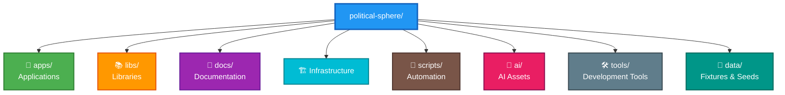
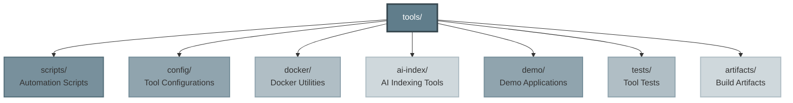
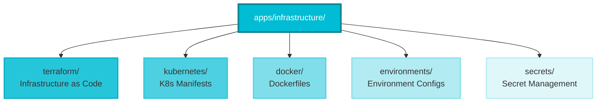
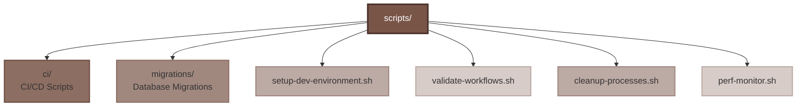
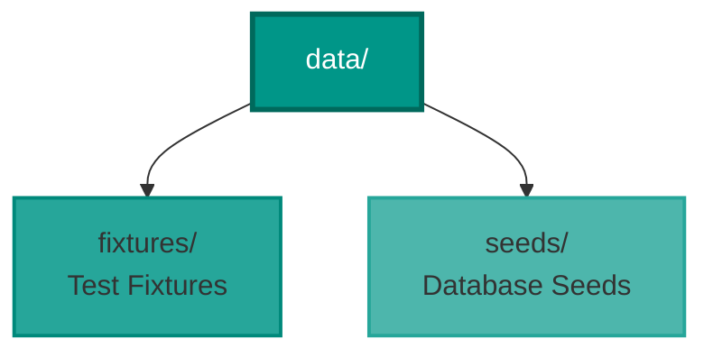

# Political Sphere - Intended File Structure

> **Complete architecture and organization guide for the Political Sphere monorepo**

## 📋 Quick Navigation

**Color Legend:**
- 🔵 Blue - Root/Primary containers
- 🟢 Green - Applications & Services
- 🟠 Orange - Libraries & Utilities
- 🟣 Purple - Documentation & Governance
- 🔷 Cyan - Infrastructure & DevOps
- 🟤 Brown - Scripts & Tools
- 🔴 Pink - AI Assets & Models

---

## 📊 Project Overview

---

## 📱 Applications (/apps)

**12+ Specialized Applications**

```mermaid
graph TB
    Apps[apps/]
    
    %% Core Services
    Apps --> API[api/<br/>REST API Backend]
    Apps --> GameServer[game-server/<br/>Real-time Engine]
    Apps --> Worker[worker/<br/>Background Jobs]
    
    %% Frontend
    Apps --> Web[web/<br/>Main React App]
    Apps --> Shell[shell/<br/>Module Federation Host]
    Apps --> AuthRemote[feature-auth-remote/<br/>Auth Microfrontend]
    Apps --> DashRemote[feature-dashboard-remote/<br/>Dashboard Microfrontend]
    
    %% Infrastructure & Support
    Apps --> Infra[infrastructure/<br/>IaC & Deployments]
    Apps --> E2E[e2e/<br/>End-to-End Tests]
    Apps --> LoadTest[load-test/<br/>Performance Testing]
    Apps --> DocsApp[docs/<br/>Documentation Site]
    Apps --> Dev[dev/<br/>Experimental Features]
    
    style Apps fill:#4CAF50,stroke:#2E7D32,stroke-width:3px,color:#fff
    style API fill:#66BB6A,stroke:#43A047,stroke-width:2px
    style GameServer fill:#66BB6A,stroke:#43A047,stroke-width:2px
    style Worker fill:#66BB6A,stroke:#43A047,stroke-width:2px
    style Web fill:#81C784,stroke:#66BB6A,stroke-width:2px
    style Shell fill:#81C784,stroke:#66BB6A,stroke-width:2px
    style AuthRemote fill:#81C784,stroke:#66BB6A,stroke-width:2px
    style DashRemote fill:#81C784,stroke:#66BB6A,stroke-width:2px
    style Infra fill:#A5D6A7,stroke:#81C784,stroke-width:2px
    style E2E fill:#A5D6A7,stroke:#81C784,stroke-width:2px
    style LoadTest fill:#A5D6A7,stroke:#81C784,stroke-width:2px
    style DocsApp fill:#A5D6A7,stroke:#81C784,stroke-width:2px
    style Dev fill:#C8E6C9,stroke:#A5D6A7,stroke-width:2px
```

---

## 📚 Libraries (/libs)

**17+ Reusable Modules**

```mermaid
graph TB
    Libs[libs/]
    
    %% Shared Utilities
    Libs --> SharedUtils[shared/utils/<br/>Common Utilities]
    Libs --> SharedTypes[shared/types/<br/>TypeScript Types]
    Libs --> SharedConstants[shared/constants/<br/>Constants]
    Libs --> SharedConfig[shared/config/<br/>Configuration]
    
    %% Platform Services
    Libs --> PlatformAuth[platform/auth/<br/>Authentication]
    Libs --> PlatformAPI[platform/api-client/<br/>API Client]
    Libs --> PlatformState[platform/state/<br/>State Management]
    Libs --> PlatformRouting[platform/routing/<br/>Routing]
    
    %% Game Engine
    Libs --> GameCore[game-engine/core/<br/>Core Logic]
    Libs --> GameSim[game-engine/simulation/<br/>Simulation]
    Libs --> GameEvents[game-engine/events/<br/>Event System]
    
    %% Infrastructure
    Libs --> InfraDB[infrastructure/database/<br/>Database Utils]
    Libs --> InfraMon[infrastructure/monitoring/<br/>Observability]
    Libs --> InfraDeploy[infrastructure/deployment/<br/>Deployment]
    
    %% UI Components
    Libs --> UIComp[ui/components/<br/>React Components]
    Libs --> UIDesign[ui/design-system/<br/>Design Tokens]
    Libs --> UIA11y[ui/accessibility/<br/>A11y Utilities]
    
    style Libs fill:#FF9800,stroke:#E65100,stroke-width:3px,color:#fff
    style SharedUtils fill:#FFB74D,stroke:#FB8C00,stroke-width:2px
    style SharedTypes fill:#FFB74D,stroke:#FB8C00,stroke-width:2px
    style SharedConstants fill:#FFB74D,stroke:#FB8C00,stroke-width:2px
    style SharedConfig fill:#FFB74D,stroke:#FB8C00,stroke-width:2px
    style PlatformAuth fill:#FFCC80,stroke:#FFB74D,stroke-width:2px
    style PlatformAPI fill:#FFCC80,stroke:#FFB74D,stroke-width:2px
    style PlatformState fill:#FFCC80,stroke:#FFB74D,stroke-width:2px
    style PlatformRouting fill:#FFCC80,stroke:#FFB74D,stroke-width:2px
    style GameCore fill:#FFE0B2,stroke:#FFCC80,stroke-width:2px
    style GameSim fill:#FFE0B2,stroke:#FFCC80,stroke-width:2px
    style GameEvents fill:#FFE0B2,stroke:#FFCC80,stroke-width:2px
    style InfraDB fill:#FFECB3,stroke:#FFE0B2,stroke-width:2px
    style InfraMon fill:#FFECB3,stroke:#FFE0B2,stroke-width:2px
    style InfraDeploy fill:#FFECB3,stroke:#FFE0B2,stroke-width:2px
    style UIComp fill:#FFF3E0,stroke:#FFECB3,stroke-width:2px
    style UIDesign fill:#FFF3E0,stroke:#FFECB3,stroke-width:2px
    style UIA11y fill:#FFF3E0,stroke:#FFECB3,stroke-width:2px
```

---

## �� Documentation (/docs)

**12 Organized Sections**

```mermaid
graph TB
    Docs[docs/]
    
    Docs --> Foundation[00-foundation/<br/>Core Principles]
    Docs --> Strategy[01-strategy/<br/>Product Vision]
    Docs --> Governance[02-governance/<br/>Policies]
    Docs --> Legal[03-legal-and-compliance/<br/>Legal Requirements]
    Docs --> Arch[04-architecture/<br/>System Architecture]
    Docs --> Engineering[05-engineering-and-devops/<br/>Development]
    Docs --> Security[06-security-and-risk/<br/>Security Policies]
    Docs --> AISim[07-ai-and-simulation/<br/>AI Governance]
    Docs --> GameDesign[08-game-design-and-mechanics/<br/>Game Design]
    Docs --> Ops[09-observability-and-ops/<br/>Operations]
    Docs --> Audit[audit-trail/<br/>Audit Logs]
    Docs --> DocControl[document-control/<br/>Version Control]
    
    style Docs fill:#9C27B0,stroke:#6A1B9A,stroke-width:3px,color:#fff
    style Foundation fill:#BA68C8,stroke:#8E24AA,stroke-width:2px
    style Strategy fill:#BA68C8,stroke:#8E24AA,stroke-width:2px
    style Governance fill:#CE93D8,stroke:#BA68C8,stroke-width:2px
    style Legal fill:#CE93D8,stroke:#BA68C8,stroke-width:2px
    style Arch fill:#E1BEE7,stroke:#CE93D8,stroke-width:2px
    style Engineering fill:#E1BEE7,stroke:#CE93D8,stroke-width:2px
    style Security fill:#F3E5F5,stroke:#E1BEE7,stroke-width:2px
    style AISim fill:#F3E5F5,stroke:#E1BEE7,stroke-width:2px
    style GameDesign fill:#F3E5F5,stroke:#E1BEE7,stroke-width:2px
    style Ops fill:#F3E5F5,stroke:#E1BEE7,stroke-width:2px
    style Audit fill:#BA68C8,stroke:#8E24AA,stroke-width:2px
    style DocControl fill:#BA68C8,stroke:#8E24AA,stroke-width:2px
```

---

## 🤖 AI Assets (/ai)

**AI Development Tools & Context**

```mermaid
graph TB
    AI[ai/]
    
    AI --> Cache[ai-cache/<br/>AI Cache Data]
    AI --> Index[ai-index/<br/>Codebase Index]
    AI --> Knowledge[ai-knowledge/<br/>Knowledge Base]
    AI --> Context[context-bundles/<br/>Context Packages]
    AI --> Prompts[prompts/<br/>Prompt Templates]
    AI --> Patterns[patterns/<br/>Code Patterns]
    AI --> Metrics[metrics/<br/>Performance Metrics]
    AI --> AIGov[governance/<br/>AI Governance Rules]
    AI --> History[history/<br/>Development History]
    AI --> Learning[learning/<br/>Training Patterns]
    
    style AI fill:#E91E63,stroke:#880E4F,stroke-width:3px,color:#fff
    style Cache fill:#F48FB1,stroke:#EC407A,stroke-width:2px
    style Index fill:#F48FB1,stroke:#EC407A,stroke-width:2px
    style Knowledge fill:#F8BBD0,stroke:#F48FB1,stroke-width:2px
    style Context fill:#F8BBD0,stroke:#F48FB1,stroke-width:2px
    style Prompts fill:#FCE4EC,stroke:#F8BBD0,stroke-width:2px
    style Patterns fill:#FCE4EC,stroke:#F8BBD0,stroke-width:2px
    style Metrics fill:#FCE4EC,stroke:#F8BBD0,stroke-width:2px
    style AIGov fill:#F48FB1,stroke:#EC407A,stroke-width:2px
    style History fill:#F8BBD0,stroke:#F48FB1,stroke-width:2px
    style Learning fill:#FCE4EC,stroke:#F8BBD0,stroke-width:2px
```

---

## 🛠️ Development Tools (/tools)

**Build Tools & Utilities**

---

## 🏗️ Infrastructure

**IaC, Kubernetes, and Cloud Resources**

---

## 🔧 Scripts (/scripts)

**Automation & CI/CD Scripts**

---

## 💾 Data (/data)

**Test Data & Seeds**

---

## 📦 Root Configuration Files

**Standard Project Files**

- `package.json` - Root package configuration
- `pnpm-workspace.yaml` - PNPM workspace configuration
- `nx.json` - Nx monorepo configuration
- `tsconfig.json` - TypeScript base configuration
- `vitest.config.js` - Test runner configuration
- `.prettierrc` - Code formatting rules
- `.eslintrc` - Linting rules
- `.gitignore` - Git ignore patterns
- `.lefthook.yml` - Git hooks configuration
- `README.md` - Project documentation
- `LICENSE` - License information
- `CHANGELOG.md` - Version history
- `CONTRIBUTING.md` - Contribution guidelines

---

## 🎯 Key Principles

### Directory Organization

1. **No files in root** - Only standard configuration files
2. **Modular structure** - Clear separation of concerns
3. **Scalable hierarchy** - Maximum 4-5 levels deep
4. **Consistent naming** - kebab-case for files/folders

### Naming Conventions

- **Files/Directories**: `kebab-case`
- **Components/Classes**: `PascalCase`
- **Functions/Variables**: `camelCase`
- **Constants**: `SCREAMING_SNAKE_CASE`

### File Placement Rules

✅ **Allowed in root:**
- Standard project files (package.json, README.md, etc.)
- Build/tool configs (nx.json, tsconfig.json, etc.)
- IDE configs (.vscode/, .editorconfig)

❌ **Never in root:**
- Application code → `/apps/`
- Library code → `/libs/`
- Documentation → `/docs/`
- Scripts → `/scripts/`
- Infrastructure → `/apps/infrastructure/`
- AI assets → `/ai/`

---

**For complete documentation, see:**
- `docs/00-foundation/organization.md` - Organization standards
- `docs/quick-ref.md` - Quick reference guide
- `.github/copilot-instructions.md` - Development guidelines
